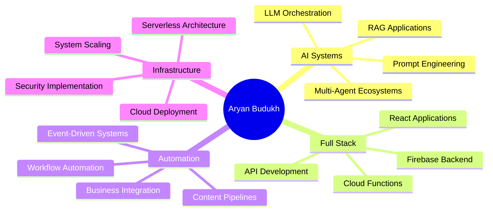

<div align="center">

<!-- Animated Header Banner -->


<!-- Animated Title -->


<!-- Futuristic Badges -->
<p>
  
  
  
</p>

<!-- Social Links with Glow Effect -->
<p>
  <a href="https://www.linkedin.com/in/aryanbudukh2710/">
    
  </a>
  <a href="mailto:aryansbudukh@gmail.com">
    
  </a>
  <a href="https://instagram.com/aryan_2710_">
    
  </a>
</p>

<!-- Animated Divider -->


</div>

<!-- Mission Statement with Gradient Background -->
<div align="center">

## 🌌 THE MISSION

</div>

<table width="100%">
<tr>
<td width="50%" valign="top">

### 💭 Philosophy

```typescript
const mission = {
  goal: "Build Intelligent Systems",
  approach: "Automate Everything",
  focus: "Scale with AI",
  impact: "Transform Businesses"
};

// I don't just write code.
// I architect the future.
```

</td>
<td width="50%" valign="top">

### ⚡ At 360Labs.ai

- 🤖 **Deploy** LLM-powered agents
- 🔄 **Replace** manual workflows  
- 📈 **Scale** businesses intelligently
- 🏗️ **Build** production AI systems

</td>
</tr>
</table>

<div align="center">

### 🎯 Every System I Build Is

<table>
<tr>
<td align="center" width="25%">
  <br/>
  <b>⚡ Automated</b><br/>
  <sub>Zero manual intervention</sub>
</td>
<td align="center" width="25%">
  <br/>
  <b>🔒 Secure</b><br/>
  <sub>Enterprise-grade protection</sub>
</td>
<td align="center" width="25%">
  <br/>
  <b>📈 Scalable</b><br/>
  <sub>Built for growth</sub>
</td>
<td align="center" width="25%">
  <br/>
  <b>🧠 AI-Native</b><br/>
  <sub>Intelligence by default</sub>
</td>
</tr>
</table>

</div>

---

<!-- Digital DNA Section -->
<div align="center">

## 🧬 DIGITAL DNA

</div>

```python
class AryanBudukh:
    """
    Full Stack AI Engineer | Systems Architect | Automation Strategist
    """
    
    def __init__(self):
        self.role = "Full Stack AI Engineer"
        self.company = "360Labs.ai"
        self.location = "India 🇮🇳"
        self.mission = "Build autonomous AI systems for real-world scale"
        
        self.core_stack = {
            "ai_ml": ["LLMs", "AI Agents", "RAG", "Prompt Engineering"],
            "frontend": ["React.js", "JavaScript", "HTML5", "CSS3"],
            "backend": ["Firebase", "Node.js", "Cloud Functions", "REST APIs"],
            "cloud": ["AWS", "GCP", "EC2", "Serverless Architecture"],
            "automation": ["n8n", "Webhooks", "API Integrations"],
            "payments": ["Razorpay", "Stripe"]
        }
        
        self.expertise = [
            "🤖 AI Agent Development",
            "🏗️ System Architecture", 
            "⚡ Automation Pipelines",
            "🔥 Full Stack Development",
            "☁️ Cloud Infrastructure"
        ]
        
    def philosophy(self):
        return "Code → Automate → Optimize → Scale → Innovate"
    
    def current_focus(self):
        return [
            "Building multi-agent AI ecosystems",
            "Designing AI-first SaaS infrastructure", 
            "Advanced system design & backend scaling",
            "Production-ready AI deployments"
        ]

# Initialize the system
engineer = AryanBudukh()
print(engineer.philosophy())
```

---

<!-- What I Build Section -->
<div align="center">

## 🚀 WHAT I BUILD


</div>

<table>
<tr>
<td width="50%">

### 🤖 AI Agent Systems

Autonomous AI workflows that **think**, **process**, **execute**, and **deliver outcomes**.

**Features:**
- 🧠 LLM-powered decision making
- 🔄 Business process automation
- 📊 Real-time data processing
- ✅ Production-ready deployment

**Stack:** `OpenAI` `Claude` `Gemini` `LangChain`

</td>
<td width="50%">

### 🔥 Full Stack AI Platforms

End-to-end intelligent applications from **concept to deployment**.

**Architecture:**
- ⚛️ React frontend systems
- 🔥 Firebase backend infrastructure
- 🔐 Role-based authentication
- 📈 Scalable cloud architecture

**Stack:** `React` `Firebase` `Node.js` `Cloud Functions`

</td>
</tr>
<tr>
<td width="50%">

### 📈 AI Content Automation

Fully autonomous content ecosystems.

**Capabilities:**
- 🎯 Viral content detection
- 💡 AI insight generation
- 📅 Auto-posting pipelines
- ⏰ Scheduled automation

**Stack:** `AI APIs` `n8n` `Webhooks` `Cron Jobs`

</td>
<td width="50%">

### 🏗️ Cloud Infrastructure

Serverless, event-driven, cost-optimized systems.

**Services:**
- ☁️ AWS / GCP / Firebase
- 🔌 API & webhook integrations
- 💳 Payment system integration
- 📦 Microservices architecture

**Stack:** `AWS` `GCP` `Serverless` `Docker`

</td>
</tr>
</table>

---

<!-- Tech Arsenal -->
<div align="center">

## 🛠️ TECH ARSENAL


</div>

### 🧠 AI & Machine Learning

<p>


</p>

### 🌐 Frontend Development

<p>


</p>

### 🔥 Backend & Cloud

<p>


</p>

### 🔗 Automation & Integration

<p>


</p>

### 🐍 Programming Languages

<p>


</p>

---

<!-- GitHub Stats Section -->
<div align="center">

## 📊 GITHUB ANALYTICS


<p>


</p>


</div>

---

<!-- Current Focus Section -->
<div align="center">

## 🎯 CURRENT FOCUS

</div>



<table width="100%">
<tr>
<td align="center" width="25%">

<br><b>AI-First SaaS</b>
<br><sub>Building intelligent products</sub>
</td>
<td align="center" width="25%">

<br><b>System Design</b>
<br><sub>Scalable architectures</sub>
</td>
<td align="center" width="25%">

<br><b>Automation</b>
<br><sub>Zero-touch workflows</sub>
</td>
<td align="center" width="25%">

<br><b>Production AI</b>
<br><sub>Enterprise deployments</sub>
</td>
</tr>
</table>

---

<!-- Professional Identity -->
<div align="center">

## 💼 PROFESSIONAL IDENTITY


</div>

<table width="100%">
<tr>
<td width="60%">

### 🎯 Current Role

**Full Stack AI Engineer** at **360Labs.ai**

Specializing in:

- ✅ End-to-end AI system development
- ✅ Production-ready deployments  
- ✅ Business process automation
- ✅ Scalable backend infrastructure
- ✅ AI-integrated applications
- ✅ Cloud architecture & DevOps

</td>
<td width="40%">

### 📚 Continuous Learning

- 🧠 Advanced AI/ML techniques
- 🏗️ System design patterns
- ☁️ Cloud-native architecture
- 🔐 Security best practices
- 📊 Data engineering
- 🚀 Performance optimization

</td>
</tr>
</table>

---

<!-- Collaboration Section -->
<div align="center">

## 🤝 LET'S COLLABORATE


</div>

### 💡 I'm Available For

<table>
<tr>
<td width="33%" align="center">

### 🚀 AI Startups
Building intelligent products<br/>from ground up

</td>
<td width="33%" align="center">

### 💼 SaaS Products
Full-stack development<br/>with AI integration

</td>
<td width="33%" align="center">

### ⚡ Automation Systems
End-to-end workflow<br/>automation

</td>
</tr>
<tr>
<td width="33%" align="center">

### 🌐 Web Platforms
Scalable, production-ready<br/>applications

</td>
<td width="33%" align="center">

### 🤖 AI Content Engines
Autonomous content<br/>generation systems

</td>
<td width="33%" align="center">

### 🏗️ System Architecture
Cloud infrastructure<br/>& backend design

</td>
</tr>
</table>

---

<!-- Contact Section -->
<div align="center">

## 📬 GET IN TOUCH

<p>
<a href="mailto:aryansbudukh@gmail.com">
  
</a>
</p>

<p>
<a href="https://www.linkedin.com/in/aryanbudukh2710/">
  
</a>
<a href="https://instagram.com/aryan_2710_">
  
</a>
</p>


</div>

---

<div align="center">

## ⚡ BUILD SYSTEMS. NOT FEATURES. ⚡


<br/>


### ⭐ From [Aryan Budukh](https://github.com/aryanbudukh)


</div>

<!-- Footer Wave -->

