<div align="center">
  
# 🚀 Welcome to Aryan's Digital Universe! 🌌


[](https://www.linkedin.com/in/aryanbudukh2710/)
[](https://instagram.com/aryan_2710_)
[](mailto:aryansbudukh@gmail.com)


</div>

---

## 🎯 About Me

```python
class AryanBudukh:
    def __init__(self):
        self.name = "Aryan Budukh"
        self.role = "Software Developer & ML Engineer"
        self.location = "India 🇮🇳"
        self.education = "Passionate Learner"
        self.current_work = ["iNeuron Intern", "RDT Intern", "360Labs"]
        self.interests = ["Machine Learning", "Deep Learning", "GenAI", "Software Development"]
        
    def say_hi(self):
        print("Thanks for dropping by! Let's build something amazing together! 🚀")

me = AryanBudukh()
me.say_hi()
```

<div align="center">
  
### 🌟 Currently Exploring

</div>

- 🔭 **Working at:** iNeuron, RDT & **360Labs** as an Intern
- 🌱 **Learning:** Data Structures & Algorithms, ML, DL, GenAI & Cutting-Edge Technologies
- 👯 **Open to Collaborate:** Machine Learning Projects, Software Development, IES VE Projects
- 🤝 **Seeking Help With:** Advanced Web Development, GCP & EC2 Deployment
- 💬 **Ask Me About:** Software Development, Machine Learning, IES Virtual Environment
- 📫 **Reach Me:** aryansbudukh@gmail.com

---

<div align="center">

## 🛠️ Tech Arsenal

### Languages & Frameworks


### AI/ML & Data Science


### Cloud & Databases


### Tools & Platforms


</div>

---

<div align="center">

## 📊 GitHub Analytics


</div>

<div align="center">
  
[](https://git.io/streak-stats)

</div>

---

<div align="center">

## 🏆 GitHub Trophies

[](https://github.com/ryo-ma/github-profile-trophy)

</div>

---

<div align="center">

## 🐍 Contribution Graph


</div>

---

<div align="center">

## 💡 Random Dev Quote


</div>

---

<div align="center">

## 🎯 Current Focus

```mermaid
graph LR
    A[Learning] --> B[DSA Mastery]
    A --> C[ML/DL Projects]
    A --> D[GenAI Applications]
    B --> E[Building Solutions]
    C --> E
    D --> E
    E --> F[Innovation 🚀]
```



</div>

---

<div align="center">

## 🤝 Let's Connect & Collaborate!

I'm always excited to work on innovative projects and connect with fellow developers and tech enthusiasts!

**💼 Open for:**
- Machine Learning Collaborations
- Software Development Projects
- IES Virtual Environment Projects
- Open Source Contributions

**🌐 Find me on:**

[](https://www.linkedin.com/in/aryanbudukh2710/)
[](https://instagram.com/aryan_2710_)
[](mailto:aryansbudukh@gmail.com)


### ⭐ From [Aryan Budukh](https://github.com/aryanbudukh) | *"Code. Learn. Innovate. Repeat."* 🚀


</div>
