<!-- Header with Gradient Background -->
<div align="center">

<!-- Large Static Name Display with Dark Gradient -->
<h1 align="center">
  
</h1>

<h3 align="center" style="color: #00F7FF; margin-top: -10px;">
  
</h3>

<!-- Dynamic Typing Animation -->
<br/>

[](https://git.io/typing-svg)

<!-- Professional Badges -->
<br/>

<div align="center">
  
  
  
</div>

<br/>

<!-- Social Connect Buttons -->
<p align="center">
  <a href="https://www.linkedin.com/in/aryanbudukh2710/">
    
  </a>
  &nbsp;&nbsp;
  <a href="mailto:aryansbudukh@gmail.com">
    
  </a>
  &nbsp;&nbsp;
  <a href="https://instagram.com/aryan_2710_">
    
  </a>
</p>

<!-- Animated Divider -->


</div>

<br/>

<!-- Mission Statement -->
<div align="center">

## 💫 THE VISION

</div>

<table width="100%">
<tr>
<td width="50%" valign="top">

```javascript
const aryan = {
  role: "Full Stack AI Engineer",
  company: "360Labs.ai",
  mission: "Transform Ideas → Intelligence",
  
  mantra: "BUILD SYSTEMS, NOT FEATURES",
  
  approach: [
    "Code with Purpose",
    "Automate Relentlessly", 
    "Scale Intelligently",
    "Deploy Fearlessly"
  ]
};

console.log(aryan.mission);
// Turning concepts into autonomous AI systems
```

</td>
<td width="50%" valign="top">

<br/>

### 🎯 Core Philosophy

**Every system I architect is:**

⚡ **Automated** - Zero human intervention  
🔒 **Secure** - Enterprise-grade by design  
📈 **Scalable** - Built to handle growth  
🧠 **AI-Native** - Intelligence at the core  

<br/>

> *"The best code writes itself. The best systems think for themselves."*

</td>
</tr>
</table>

<br/>

<!-- What I Build Section -->
<div align="center">

## 🚀 WHAT I BUILD

</div>

<table width="100%">
<tr>
<td width="50%" align="center" valign="top">

### 🤖 AI Agent Ecosystems


**Autonomous systems that:** 🧠 Make decisions with LLMs | 🔄 Execute complex workflows | 📊 Process data in real-time | ✅ Deploy to production

`OpenAI` `Claude` `Gemini` `RAG`

</td>
<td width="50%" align="center" valign="top">

### 🔥 Full Stack Platforms


**End-to-end applications:** ⚛️ React frontends | 🔥 Firebase backends | 🔐 Secure authentication | 📈 Cloud infrastructure

`React` `Node.js` `Firebase` `AWS`

</td>
</tr>
<tr>
<td width="50%" align="center" valign="top">

### 📈 Automation Engines


**Intelligent workflows:** 🎯 Content generation | 💡 Insight extraction | 📅 Scheduled pipelines | ⏰ Event-driven systems

`n8n` `Webhooks` `API Integration`

</td>
<td width="50%" align="center" valign="top">

### ☁️ Cloud Infrastructure


**Serverless systems:** 🌐 Multi-cloud architecture | 🔌 Microservices design | 💳 Payment integration | 📦 Container orchestration

`AWS` `GCP` `Docker` `Serverless`

</td>
</tr>
</table>

<br/>

<!-- Tech Stack Section -->
<div align="center">

## 🛠️ TECHNOLOGY STACK

</div>

### 🧠 Artificial Intelligence & Machine Learning

<p align="center">

<br/>


</p>

### 🌐 Full Stack Development

<p align="center">

<br/>


</p>

### ☁️ Backend & Cloud Technologies

<p align="center">

<br/>


</p>

### 🔗 Automation & Integration

<p align="center">


</p>

### 💻 Programming Languages

<p align="center">

</p>

<br/>

<!-- Contribution Graph -->
<div align="center">

## 📈 CONTRIBUTION ACTIVITY


</div>

<br/>

<!-- Current Focus -->
<div align="center">

## 🎯 CURRENT FOCUS

```mermaid
mindmap
  root((🚀 Aryan))
    🤖 AI Systems
      Multi-Agent Workflows
      LLM Orchestration
      RAG Pipelines
      Prompt Engineering
    🔥 Full Stack
      React Apps
      Firebase Backend
      Cloud Functions
      Real-time Systems
    ⚡ Automation
      Content Pipelines
      Business Integration
      Workflow Optimization
      Event-Driven Architecture
    ☁️ Infrastructure
      Serverless Design
      Container Orchestration
      CI/CD Pipelines
      Cloud Security
```

</div>



<br/>

<!-- Expertise Highlight -->
<div align="center">

## 💡 EXPERTISE AREAS

<table>
<tr>
<td align="center" width="25%">
<br/>

<br/><br/>
<b>🤖 AI Engineering</b>
<br/><br/>
<sub>Building intelligent systems<br/>that think & execute</sub>
<br/><br/>
</td>
<td align="center" width="25%">
<br/>

<br/><br/>
<b>🏗️ System Design</b>
<br/><br/>
<sub>Architecting scalable<br/>production infrastructure</sub>
<br/><br/>
</td>
<td align="center" width="25%">
<br/>

<br/><br/>
<b>⚡ Automation</b>
<br/><br/>
<sub>Zero-touch workflows<br/>that run themselves</sub>
<br/><br/>
</td>
<td align="center" width="25%">
<br/>

<br/><br/>
<b>☁️ Cloud Native</b>
<br/><br/>
<sub>Serverless, scalable<br/>cloud deployments</sub>
<br/><br/>
</td>
</tr>
</table>

</div>

<br/>

<!-- Professional Experience -->
<div align="center">

## 💼 PROFESSIONAL JOURNEY

</div>

<table width="100%">
<tr>
<td width="50%" valign="top">

### 🎯 360Labs.ai - Full Stack AI Engineer

**Building the future of intelligent automation**

✅ Design & deploy multi-agent AI systems  
✅ Architect full-stack web applications  
✅ Implement business process automation  
✅ Build scalable cloud infrastructure  
✅ Integrate AI into production systems  
✅ Optimize performance & security  

**Impact:**
- 🚀 Reduced manual workflows by 80%
- 💡 Deployed 15+ AI-powered features
- 📈 Scaled systems to handle 10x traffic
- 🔒 Maintained 99.9% uptime

</td>
<td width="50%" valign="top">

### 🌱 Continuous Growth

**Always Learning:**

📚 Advanced AI/ML techniques  
🏗️ Enterprise system design  
☁️ Cloud architecture patterns  
🔐 Security best practices  
📊 Data engineering pipelines  
🚀 DevOps & automation  

**Current Focus:**

🎯 Multi-agent orchestration  
🎯 AI-first SaaS products  
🎯 Real-time systems  
🎯 Serverless architecture  

**Tech Evolution:**

🔥 Exploring edge computing  
🔥 Mastering distributed systems  
🔥 Deep diving into system optimization  

</td>
</tr>
</table>

<br/>

<!-- Collaboration CTA -->
<div align="center">

## 🤝 LET'S BUILD TOGETHER


<br/><br/>

### 💡 Open to Collaborate On

<table>
<tr>
<td align="center" width="33%">
<br/>
<h3>🚀 AI Startups</h3>
Intelligent products from concept to launch
<br/><br/>
</td>
<td align="center" width="33%">
<br/>
<h3>💼 SaaS Platforms</h3>
Full-stack systems with AI integration
<br/><br/>
</td>
<td align="center" width="33%">
<br/>
<h3>⚡ Automation</h3>
End-to-end workflow optimization
<br/><br/>
</td>
</tr>
<tr>
<td align="center" width="33%">
<br/>
<h3>🌐 Web Apps</h3>
Scalable, modern applications
<br/><br/>
</td>
<td align="center" width="33%">
<br/>
<h3>🤖 AI Agents</h3>
Autonomous systems & orchestration
<br/><br/>
</td>
<td align="center" width="33%">
<br/>
<h3>☁️ Infrastructure</h3>
Cloud architecture & deployment
<br/><br/>
</td>
</tr>
</table>

</div>

<br/>

<!-- Contact Section -->
<div align="center">

## 📬 CONNECT WITH ME

<br/>

<a href="mailto:aryansbudukh@gmail.com">
  
</a>

<br/><br/>

<a href="https://www.linkedin.com/in/aryanbudukh2710/">
  
</a>
&nbsp;&nbsp;
<a href="https://instagram.com/aryan_2710_">
  
</a>
&nbsp;&nbsp;
<a href="https://github.com/SKULLFIRE07">
  
</a>

</div>

<br/><br/>

<!-- Philosophy Footer -->
<div align="center">

## ⚡ BUILD SYSTEMS. NOT FEATURES. ⚡

<br/>

[](https://git.io/typing-svg)

<br/>

**⭐ From [Aryan Budukh](https://github.com/SKULLFIRE07) | Building Tomorrow's Intelligence Today**

</div>

<br/>

<!-- Footer Wave -->

